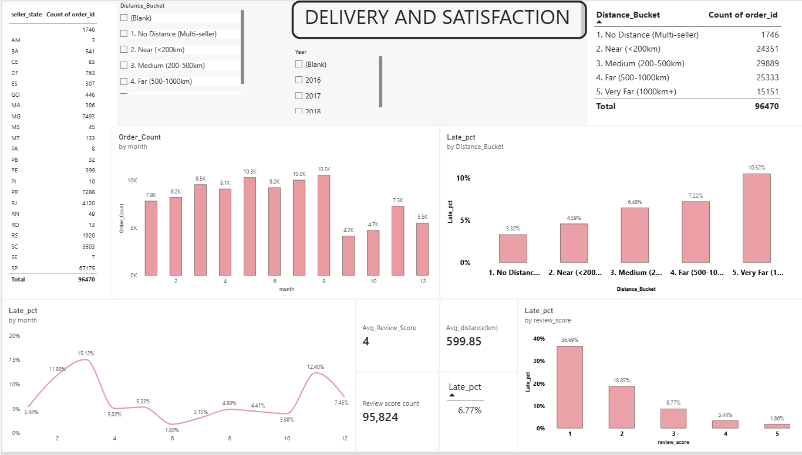
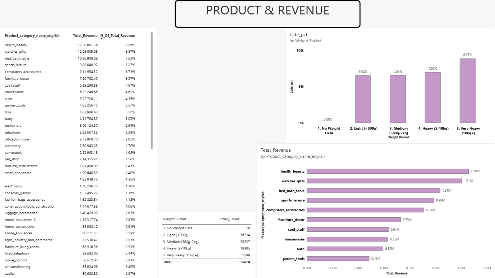

# olist-ecommerce-analysis

SQL and Power BI analysis of 100K Brazilian e-commerce orders — investigating how delivery distance and delay affect customer satisfaction

## Data

Brazilian e-commerce public dataset (Olist) from Kaggle, loaded into SQL Server.

## SQL views (sql/)

Built incrementally, each one checked against known row counts before being used downstream:

- `vw_delivered_orders` — delivered orders with a corrected, date-level `is_late` flag
- `vw_order_review` — one review per order (deduplicated; some review_ids span multiple orders from the same checkout)
- `vw_geolocation_clean` — average lat/lng per zip prefix, outlier coordinates filtered out
- `vw_single_seller_distance` — real customer-to-seller distance in km (geography::STDistance), single-seller orders only
- `distance_vs_delay` — standalone query used to validate the distance/delay finding in SQL before rebuilding it as a DAX measure in Power BI; not used by any other view.
- `vw_order_analysis` — unified order-level table joining the above (fact_orders in Power BI)
- `vw_dim_customer` — one row per person (customer_unique_id), most recent address
- `vw_dim_seller` — one row per seller
- `vw_dim_product` — one row per product, joined to English category translations
- `vw_fact_order_items` — one row per order line item (price, product, seller)
- `vw_weight_vs_delay` — order-level weight buckets (total weight per order) vs late-delivery rate — standalone validation query, same pattern as distance_vs_delay

## Key findings

- **Delay → review score:** late deliveries get sharply worse reviews — ~1.9% late for 5-star orders vs ~37% late for 1-star orders.
- **Distance → delay:** late-delivery rate rises with distance — 4.59% under 200km, up to 10.52% over 1000km.
- Orders split across multiple sellers (no single distance) have the lowest late rate of any group, at 3.32%.
- **Late rate spikes are not a single seasonal pattern** — they differ by year and cause. November 2017 saw both an order volume surge (4.5K → 7.3K orders) and a late-rate spike to 12.4%, consistent with holiday demand straining delivery capacity. March 2018 saw a late-rate spike to 19% with no matching volume increase, suggesting a different, unexplained cause. 2016 data is too sparse (267 orders) for seasonal analysis.
- `Order_items` contains line items for all orders regardless of status; only delivered orders have corresponding rows in fact_orders.
- 610 of 32,951 products have no category assigned at all in the source data. A further 13 have a Portuguese category name with no matching entry in the 71-row translation lookup table (e.g. "pc_gamer", "portateis_cozinha_e_preparados_de_alimentos").
- **Product weight → delay (minor effect):** late-delivery rate is roughly flat for
  light-to-medium orders (6.54% vs 6.58%), then rises for heavy and very heavy orders
  (7.00%, 8.87%). A much weaker effect than distance or review score.

## Power BI Dashboard

Star schema: `fact_orders` (order grain) related to `dim_customer` (customer_unique_id),
`dim_seller` (seller_id), and `dim_date` (order_date, with an inactive relationship to
delivery_date). `fact_order_items` (line-item grain) relates to `fact_orders` and `dim_product`.

**Key measures:** Late Percentage, Avg Review Score, Avg Distance (km), Total Revenue, % of Total Revenue

### Page 1 — Delivery & Satisfaction

### Page 2 — Product & Revenue
